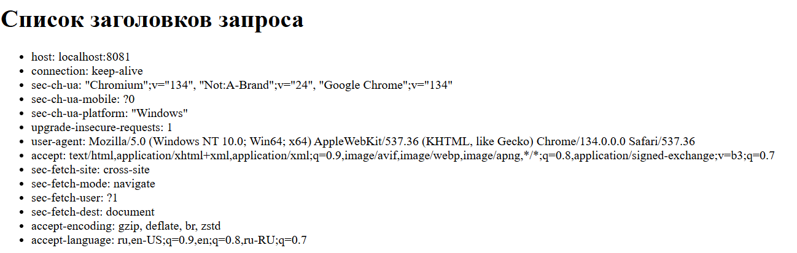
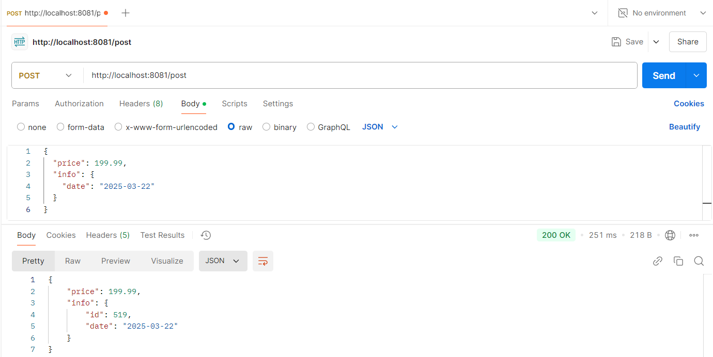

# Task 4. Web Service
**ФИО:** Кабицкий Георгий Станиславович

**Преподаватель:** Рогожников Дмитрий

**1. WebApplicationContext**  
WebApplicationContext – это расширение стандартного ApplicationContext в Spring, предназначенное для веб-приложений. Он предоставляет функционал, необходимый для работы с веб-слоем, включая интеграцию с Servlet API, поддержку контроллеров, view resolvers и других компонентов, специфичных для веб-среды

**2. Mapping**
Маппинги определяют, как HTTP-запросы сопоставляются с методами контроллеров.

**Типы:**
- **@GetMapping** —  обрабатывает GET-запросы
- **@PostMuping** — обрабатывает POST-запросы
- **@PutMapping** — обрабатывает PUT-запросы
- **@DeleteMapping** — обрабатывает DELETE-запросы
- **@PatchMapping** — обрабатывает PATCH-запросы

**Основные параметры маппингов:**
- **path / value** — URL-путь, который обрабатывает метод 
- **method** —  HTTP-метод
- **produces** — указывает, какой тип контента метод возвращает
- **params** — фильтрация по параметрам запроса 
- **consumes** — ограничивает типы контента, которые метод может принять
- **headers** — фильтрация по заголовкам HTTP

**3. Реализация**  

В проекте реализованы два контроллера:

``HeadersController`` – обрабатывает GET-запрос на /headers, собирает все заголовки HTTP-запроса и передает их в модель для отображения на представлении.

``JsonController`` – обрабатывает POST-запрос на /post, принимает JSON-данные, обрабатывает их и возвращает JSON-ответ.  

DTO:  
``RequestDTO`` – объект запроса, содержащий ``price`` и вложенный объект ``InfoDate``  
``ResponseDTO`` – объект ответа, содержащий ``price`` и вложенный объект ``InfoDateId``, в котором автоматически генерируется случайный ``id``.  
``InfoDate`` – объект, содержащий только поле ``date``.  
``InfoDateId`` – объект, содержащий ``id`` и ``date``.

Создан глобальный обработчик ошибок ``HandlerException``, который перехватывает исключения и возвращает HTTP-ответ с кодом ``502 Bad Gateway`` и сообщением об ошибке.

